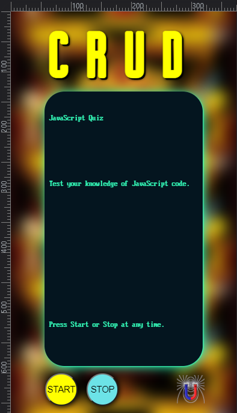
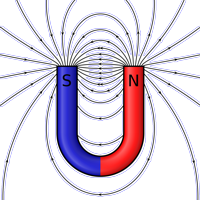

# <Your-Project-Title>C.R.U.D.
## U of T Coding Boot Camp: # 04 Web APIs 
### [Installation](#installation)  - [Usage](#usage)  - [Credits](#credits)  - [License](#license) - [Features](#Features)
&nbsp;
## Description
  This application began as an assignment for a course and became a passion project that nearly killed me - well, actually, I just tried to make it much more than it needed to be and I got behind on my work and skipped dinner one night because I was working on it.

The following is a short description of my experience completing the project:

- I woke up inspired with an idea for driving my quiz application with simple inputs like the old arcade consoles from back in the day.
- I realized I could create my own object and simply push and pull my way through the data I stored there and I could structure it so that I could used the architecture for any game - just like the shells of the old arcade games.  It was going to be a thing of beauty - an homage to Pong and all the old tech.  I had my own Jodorowsky's Dune style experience instead - well, not quite that bad.  I did submit this afterall.
- The most significant learning I did was that some time saving structures can become overly labourious to realize -- there is a happy medium.

## Installation
To set up the website:
 - upload the index.html, style.css and script.js file along with the assets folder and all of its contents to the host server. 
## Usage
Use this quiz to test your coding abilities.

[See it online now](https://h0rsesh0e.github.io/quickCodeQuiz/)  

## Credits
This is my fourth project in the Coding Boot Camp provided by [The School of Continuing Studies, University of Toronto](https://learn.utoronto.ca/) and [Trilogy Education Services](https://www.trilogyed.com/). I was inspired by the art from Joust the video game and use it in a significantly modified form in the website.

## License
All content excluding typefaces, registered trade marks and the background image are the exclusive property of David Baron and or Tirlogy Education Services and or The School of Continuing Studies, University of Toronto.

## Features
CRUD is difficult to describe, but it's better than it sounds.  It has two buttons and a warm green glow.  But don't let me spoil it for you.  You've got to try CRUD for yourself.

&nbsp;

&nbsp;

**H0RSESH0E**
